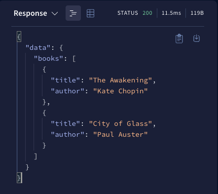

这份教程可以帮你：

- 对 GraphQL 理念有基本的理解
- 定义一份符合你数据集结构的 GraphQL **schema**
- 运行一个 Apollo Server 实例，它可以让你根据 schema 执行 query

这份教程，假设你熟悉命令行和 JavaScript，并且已经安装了近期版本的 Node.js(v14.16.0)。另外，对于感兴趣的人，这份教程包含了如何用 TypeScript 设置 Apollo Server 的可选章节

## Step 1：创建项目

1. 为新项目创建一个目录：

```bash
mkdir graphql-server-example
cd graphql-server-example
```

2. 使用`npm`初始化 Node.js 项目(或者使用其他包管理器，例如 Yarn)：

```bash
npm init --yes && npm pkg set type="module"
```

> 这份教程使用 ES Modules 设置项目，可以简化我们的示例并允许我们使用 top-level `await`。

现在，你的项目包含了一个`package.json`文件。

## Step 2：安装依赖

运行 Apollo Server 需要 2 个顶层依赖：

- `GraphQL`(也被称作`graphql-js`)是实现核心 GraphQL 解析和执行算法的库。
- `@apollo/server`是 Apollo Server 自身主要的库。Apollo Server 知道如何将 HTTP 请求与响应转变为 GraphQL operation 并在支持插件和其他功能的、可扩展的上下文中运行它们。

运行下面的命令来安装这些依赖：

```bash
npm install @apollo/server graphql
```

## Step 3：定义 GraphQL schema

> **下面的代码块默认使用 TypeScript**。你可以使用每个代码块前的下拉菜单来切换到 JavaScript。
>
> 如果正在使用 JavaScript，在`.ts`和`.tsx`出现的地方，使用`.js`和`.jsx`扩展名。

每个 GraphQL Server(包括 Apollo Server)使用 schema 来定义 client 可以 query 的数据的结构。在这个例子中，我们将创建一个 server，用于通过 title 和 author 来查询到 books 的集合。

打开`index.ts`

```javascript
import { ApolloServer } from "@apollo/server";
import { startStandaloneServer } from "@apollo/server/standalone";

// A schema is a collection of type definitions (hence "typeDefs")
// that together define the "shape" of queries that are executed against
// your data.
const typeDefs = `#graphql
  # Comments in GraphQL strings (such as this one) start with the hash (#) symbol.

  # This "Book" type defines the queryable fields for every book in our data source.
  type Book {
    title: String
    author: String
  }

  # The "Query" type is special: it lists all of the available queries that
  # clients can execute, along with the return type for each. In this
  # case, the "books" query returns an array of zero or more Books (defined above).
  type Query {
    books: [Book]
  }
`;
```

> 添加`#graphql`到模版字面量的开头，可以在一些 IDE 中开启 GraphQL 语法高亮。

这段代码定义了一个简单、有效的 schema。client 可以执行名为`books`的 query，并且我们的 server 将返回 0 或多个`Book`对象组成的数组。

## Step 4：定义数据集

既然我们已经定义了数据的*结构*，我们就可以定义数据本身了。

Apollo Server 可以获取数据从你连接的任意数据源(包括数据库、REST API、静态对象存储服务或另一个 GraphQL server)。因为这份教程的目的，我们将硬编码我们示例使用的数据。

添加下面代码到`index.ts`文件底部：

```javascript
const books = [
  {
    title: "The Awakening",
    author: "Kate Chopin",
  },
  {
    title: "City of Glass",
    author: "Paul Auster",
  },
];
```

这段代码定义了 client 可以查询的数据集。
注意，数组中的 2 个对象，每一个都符合我们在 schema 中定义的`Book`类型的结构。

## Step 5：定义 resolver

我们已经定义了数据集，但是 Apollo Server 不知道当它执行 query 时，应该如何使用这些数据。为了解决这个问题，我们创建 **resolver**。

Resolver 告诉 Apollo Server 如何获取关联特定类型的数据。因为我们的`Book`数组是硬编码的，所以相应的 resolver 非常简单。

添加下面代码到`index.ts`文件底部：

```javascript
// Resolvers define how to fetch the types defined in your schema.
// This resolver retrieves books from the "books" array above.
const resolvers = {
  Query: {
    books: () => books,
  },
};
```

## Step 6：创建 Apollo Server 实例

我们已经定义了 schema、数据集和 resolver。现在我们需要在初始化 Apollo Server 的时候，给它提供这些信息。

添加下面代码到`index.ts`文件底部：

```javascript
// The ApolloServer constructor requires two parameters: your schema
// definition and your set of resolvers.
const server = new ApolloServer({
  typeDefs,
  resolvers,
});

// Passing an ApolloServer instance to the `startStandaloneServer` function:
//  1. creates an Express app
//  2. installs your ApolloServer instance as middleware
//  3. prepares your app to handle incoming requests
const { url } = await startStandaloneServer(server, {
  listen: { port: 4000 },
});

console.log(`🚀  Server ready at: ${url}`);
```

> 这份教程使用 Apollo Server 的 [standalone web server](https://www.apollographql.com/docs/apollo-server/api/standalone/)。如果你想集成 Apollo Server 到你在用的 web 框架，例如 Express，参考我们的[web framework integration](https://www.apollographql.com/docs/apollo-server/integrations/integration-index)。

## Step 7：运行 server

我们准备启动我们的 server！在项目根目录，执行以下命令：

```bash
npm start
```

现在，你应该在控制台底部看到了下面的输出：

```bash
🚀  Server ready at: http://localhost:4000/
```

成功！

## Step 8：执行第一个 query

现在，可以在我们的 server 上执行 GraphQL query 了。为了执行第一个 query，我们可以使用 [Apollo Sandbox](https://www.apollographql.com/docs/graphos/explorer/sandbox/)。

在浏览器访问`http://localhost:4000`，它将打开 Apollo Sandbox：


Sandbox UI 包括：

- Operation 面板，用于编写和查询 query(在中间)。
- Response 面板，用于显示 query 的结果(在右边)。
- 标签页，用于 schema 查询、搜索和设置(在左边)。
- URL 输入框，用于连接其他的 GraphQL server(在左上角)。

我们的 server 支持一个名为`books`的 query，让我们来执行它！

这里是用来执行`books`的 GraphQL query 字符串：

```graphql
query GetBooks {
  books {
    title
    author
  }
}
```

粘贴这段字符串到 Operation 面板并点击右上角的蓝色按钮。结果(从我们硬编码的数据集计算出)会出现在 Response 面板中：



> **注意：**如果 Apollo Sandbox 无法找到你的 schema，确认是否通过将`introspection: true`传递给`ApolloServer`构造函数，以开启 schema 的 introspection 功能。我们建议在生产环境中禁用 introspection 功能，因为它会暴露你的 schema 的细节。

GraphQL 最重要的理念之一，是 client 可以选择*只查询它们需要的字段*。从 query 字符串中删除`author`然后再执行。返回值更新为每个 book 对象只包含`title`字段！

## 完善示例

你可以在 Code Sandbox 访问并 fork 完整的示例代码：

[Edit in CodeSandbox](https://codesandbox.io/p/sandbox/github/apollographql/docs-examples/tree/main/apollo-server/v4/getting-started?fontsize=14&hidenavigation=1&theme=dark)

## 进阶

这个示例应用是一个学习 Apollo Server 的良好开端。查看下面的资源，去学习更多关于 schema、resolver 和生成类型的基础：

- [Schema basics](https://lin-xii.github.io/blog/docs/Apollo%20Server/Defining%20a%20Schema/graphql-schema-basics)
- [Resolver](https://lin-xii.github.io/blog/docs/Apollo%20Server/Resolving%20Operations/resolvers)
- [Generating TS types for your schema](https://www.apollographql.com/docs/apollo-server/workflow/generate-types/)

想学习如何模块化和缩放 GraphQL API？查看 Apollo Federation Docs 以学习 federated 架构如何创建统一的、包含多个 GraphQL API 的 supergraph。

如果你想在特定 web 框架中使用 Apollo Server，参考我们的 [list of integrations](https://www.apollographql.com/docs/apollo-server/integrations/integration-index/)。如果我们没有你在用框架的集成方案，你可以[创建一个](https://www.apollographql.com/docs/apollo-server/integrations/building-integrations/)以帮助我们的社区。
