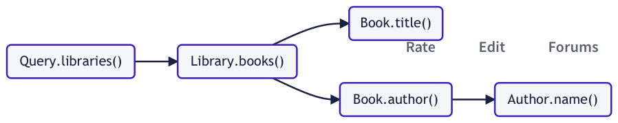
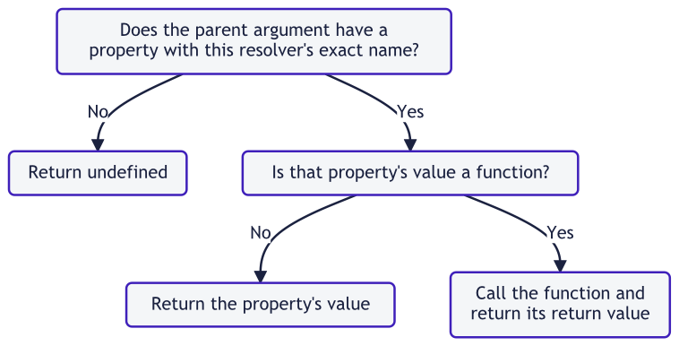

Apollo Server 需要知道如何为 schema 中的每个字段填充数据，以让它可以响应查询数据的请求。为了实现这一点，它使用 resolver。

**resolver 是一个负责给 schema 中单个字段填充数据的函数。**它可以填充以任何方式定义的数据，例如查询后端数据库或者第三方 API。

> 如果不为特定字段定义 resolver，Apollo Server 将为这个字段定义一个[default resolver](https://www.apollographql.com/docs/apollo-server/data/resolvers#default-resolvers)。

## 定义 resolver

### 基础语法

假设我们服务器定义了以下(非常简短)的 schema：

```graphql
type Query {
  numberSix: Int! # Should always return the number 6 when queried
  numberSeven: Int! # Should always return 7
}
```

我们想要给根`Query`类型的`numberSix`和`numberSeven`字段定义 resolver，以让它们在需要的时候，永远返回`6`和`7`。

这些 resolver 的定义大概如下：

```typescript
const resolvers = {
  Query: {
    numberSix() {
      return 6;
    },
    numberSeven() {
      return 7;
    },
  },
};
```

#### 如例子所示：

- 服务器上所有的 resolver 被定义在一个单独的 JavaScript 对象中(前面示例中被命名为`resolvers`)。这个对象被称作**resolver map**。
- resolver map 拥有与 schema 的类型(如前面示例中的`Query`)相对应的顶级字段。
- 每一个 resolver 函数都属于对应字段所属的类型。

> 私货：resolver 和 resolver map，不是一个概念。
>
> resolver->field
>
> resolver map->top-level type(更偏向 schema 整体的层级)

### 传递参数

假设我们定义了如下的 schema：

```graphql
type User {
  id: ID!
  name: String
}

type Query {
  user(id: ID!): User
}
```

我们希望能够通过 user 的`id`来查询`user`字段，以获取 user 对应的信息。

为了达到这个目的，我们的服务器需要访问 user 数据。针对这个认为的例子，假设我们的服务器定义了如下硬编码的数组：

```typescript
const users = [
  {
    id: "1",
    name: "Elizabeth Bennet",
  },
  {
    id: "2",
    name: "Fitzwilliam Darcy",
  },
];
```

现在我们可以给`user`字段定义 resolver，像下面这样：

```typescript
const resolvers = {
  Query: {
    user(parent, args, contextValue, info) {
      return users.find((user) => user.id === args.id);
    },
  },
};
```

#### 如例子所示：

- resolver 可以选择接收四个参数：`(parent, args, contextValue, info)`

  - 更多细节，参考[arguments](https://www.apollographql.com/docs/apollo-server/data/resolvers#resolver-arguments)

- `args`参数是一个对象，它包含了通过 GraphQL operation 提供给字段的所有 _GraphQL_ 参数。

> 注意，这个例子没有给`User`字段(`id`和`name`)定义 resolver。是因为 Apollo Server 为这些字段创建的 [default resolver](https://www.apollographql.com/docs/apollo-server/data/resolvers#default-resolvers) 做了正确的事：它直接从对象获取值并通过`user`resolver 返回。

## 将 resolver map 传递给 Apollo Server

> 在下面的例子中，我们使用顶层`await`来异步起动我们的服务器。如果你想了解如何配置，请查看 [Getting Started](https://www.apollographql.com/docs/apollo-server/getting-started#step-2-install-dependencies) 获取更多详细信息。

在定义了所有 resolver 之后，搭配着 schema 的定义(作为`typeDefs`属性)一起，将它们(作为`resolvers`属性)传递给`Apollo Server`的构造函数。

下面的例子定义了硬编码的数据集、schema 和 resolver map。在将 schema 和 resolver map 传递给`Apollo Server`后初始化了实例。

```javascript
import { ApolloServer } from "@apollo/server";
import { startStandaloneServer } from "@apollo/server/standalone";

// Hardcoded data store
const books = [
  {
    title: "The Awakening",
    author: "Kate Chopin",
  },
  {
    title: "City of Glass",
    author: "Paul Auster",
  },
];

// Schema definition
const typeDefs = `#graphql
  type Book {
    title: String
    author: String
  }

  type Query {
    books: [Book]
  }
`;

// Resolver map
const resolvers = {
  Query: {
    books() {
      return books;
    },
  },
};

// Pass schema definition and resolvers to the
// ApolloServer constructor
const server = new ApolloServer({
  typeDefs,
  resolvers,
});

// Launch the server
const { url } = await startStandaloneServer(server);

console.log(`🚀 Server listening at: ${url}`);
```

注意，你可以在多个文件和对象中定义 resolver，只要将所有 resolver 合并到一个单独的、被传递给`ApolloServer`构造函数的 resolver map 即可。

## Resolver chain

当 query 请求一个返回值为对象类型的字段时，这个 query 至少也要访问该对象(如果没有查询该对象中的字段，没有理由在 query 中包含这个对象)字段中的一个。一个 query 最底层的字段，永远返回 scalar、enum 或者它们的列表。

> 私货：bottom out，最底层？我好像明白了，但是嘴说不出来 🤣

举个例子，`Product`类型的所有字段都属于“bottom out”：

```graphql
type Product {
  id: ID!
  name: String
  variants: [String!]
  availability: Availability!
}

enum Availability {
  AVAILABLE
  DISCONTINUED
}
```

由于这个规则，Apollo Server 解析一个返回值为对象类型的字段时，它永远会解析这个对象的一个或更多字段。那些子字段或许也包含对象类型。根据 schema，object-field 模式可以持续到任意深度，这个过程被称为 **resolver chain**。

### 例子

假设服务器定义了如下的 schema：

```graphql
# A library has a branch and books
type Library {
  branch: String!
  books: [Book!]
}

# A book has a title and author
type Book {
  title: String!
  author: Author!
}

# An author has a name
type Author {
  name: String!
}

type Query {
  libraries: [Library]
}
```

下面是一个针对该 schema 有效的 query：

```graphql
query GetBooksByLibrary {
  libraries {
    books {
      author {
        name
      }
    }
  }
}
```

这个 query 的 resolver chain 查询过程，符合 query 本身的层级结构：


这些 resolver 按前面所示的顺序执行，并且它们各自的返回值都会通过`parent`参数传递给下一个处于 resolver chain 中的 resolver。

这里有一段代码示例，它可以用这个 resolver chain 解析前面的 query：

```javascript
import { ApolloServer } from "@apollo/server";
import { startStandaloneServer } from "@apollo/server/standalone";

const libraries = [
  {
    branch: "downtown",
  },
  {
    branch: "riverside",
  },
];

// The branch field of a book indicates which library has it in stock
const books = [
  {
    title: "The Awakening",
    author: "Kate Chopin",
    branch: "riverside",
  },
  {
    title: "City of Glass",
    author: "Paul Auster",
    branch: "downtown",
  },
];

// Schema definition
const typeDefs = `#graphql
  # A library has a branch and books
  type Library {
    branch: String!
    books: [Book!]
  }

  # A book has a title and author
  type Book {
    title: String!
    author: Author!
  }

  # An author has a name
  type Author {
    name: String!
  }

  # Queries can fetch a list of libraries
  type Query {
    libraries: [Library]
  }
`;

// Resolver map
const resolvers = {
  Query: {
    libraries() {
      // Return our hardcoded array of libraries
      return libraries;
    },
  },
  Library: {
    books(parent) {
      // Filter the hardcoded array of books to only include
      // books that are located at the correct branch
      return books.filter((book) => book.branch === parent.branch);
    },
  },
  Book: {
    // The parent resolver (Library.books) returns an object with the
    // author's name in the "author" field. Return a JSON object containing
    // the name, because this field expects an object.
    author(parent) {
      return {
        name: parent.author,
      };
    },
  },

  // Because Book.author returns an object with a "name" field,
  // Apollo Server's default resolver for Author.name will work.
  // We don't need to define one.
};

// Pass schema definition and resolvers to the
// ApolloServer constructor
const server = new ApolloServer({
  typeDefs,
  resolvers,
});

// Launch the server
const { url } = await startStandaloneServer(server);

console.log(`🚀 Server listening at: ${url}`);
```

如果更新 query 还去查询每本 book 的`title`字段：

```graphql
query GetBooksByLibrary {
  libraries {
    books {
      title
      author {
        name
      }
    }
  }
}
```

resolver chain 看起来就是下面的样子了：


当一个 resolver chain 像这样分叉后，每一个 subchain 都可以并行执行。

## Resolver 参数

resolver 函数被传递了 4 种参数：`parent`、`args`、`contextValue`和`info`(按顺序排列)。

> 你可以在代码中使用任何名字来命名这些参数，但是 Apollo 文档使用这些名称作为惯例。也常用父类型的名字或`source`来替代`parent`。

| 参数           | 描述                                                                                                                                                                                                                                                                                                |
| -------------- | --------------------------------------------------------------------------------------------------------------------------------------------------------------------------------------------------------------------------------------------------------------------------------------------------- |
| `parent`       | 这个字段父级 resolver 的返回值(也就是指，[resolver chain](https://www.apollographql.com/docs/apollo-server/data/resolvers#resolver-chains) 中的前一个 resolver)。 对于没有父级的顶级字段的 resolver(例如`Query`的字段)，这个值从传递给 Apollo Server 构造函数的`rootValue`函数获取。                |
| `args`         | 一个包括提供给这个字段全部 GraphQL 参数的对象。举个例子，当执行`query{ user(id: "4")}`时，被传递给`user`resolver 的`args`对象是`{ "id": "4"}`                                                                                                                                                       |
| `contextValue` | 在一个 operation 执行的全部 resolver 中共享的对象。使用这个对象分享给每个 operation 的状态，包括认证信息、dataloader 实例和任何其他跨 resolver 访问的信息。查看[`contextValue` argument](https://www.apollographql.com/docs/apollo-server/data/resolvers#the-contextvalue-argument)以了解更多信息。 |
| `info`         | 容纳关于 operation 执行状态的信息，包括字段名称、从根字段到这个字段的路径和更多信息。它的核心字段被列在[GraphQL.js 源码](https://github.com/graphql/graphql-js/blob/f851eba93167b04d6be1373ff27927b16352e202/src/type/definition.ts#L891-L902)。Apollo Server 使用`cacheControl`字段来完善它。      |

### `contextValue`参数

> **resolver 永远不应该破坏性地修改`contextValue`参数。**这确保了所有 resolver 之间的一致性并防止非预期错误的产生。

resolver 通过第三个参数可以访问共享的`contextValue`对象。为指定 operation 执行的所有 resolver 都可以访问`contextValue`：

```typescript
import { UserAPI } from "./datasources/users";

const resolvers = {
  Query: {
    // Our resolvers can access the fields in contextValue
    // from their third argument
    currentUser: (_, __, contextValue) => {
      return contextValue.dataSources.userApi.findUser(contextValue.token);
    },
  },
};

interface MyContext {
  // Context typing
  token?: String;
  dataSources: {
    userApi: UserAPI;
  };
}

const server = new ApolloServer<MyContext>({
  typeDefs,
  resolvers,
});

const { url } = await startStandaloneServer(server, {
  context: async ({ req }) => ({
    token: getToken(req.headers.authentication),
    dataSources: {
      userApi: new UserAPI(),
    },
  }),
});
```

> 了解更多关于管理连接数据库或其他数据源，请参考[Fetching Data](https://www.apollographql.com/docs/apollo-server/data/fetching-data)

更多信息和示例，参考[Sharing context](https://www.apollographql.com/docs/apollo-server/data/context)。

## 返回值

resolver 函数的返回值，根据它的类型被 Apollo Server 以不同方式处理。

| 类型               | 描述                                                                                                                                                                                                                                                                                                                                                                                                                                    |
| ------------------ | --------------------------------------------------------------------------------------------------------------------------------------------------------------------------------------------------------------------------------------------------------------------------------------------------------------------------------------------------------------------------------------------------------------------------------------- |
| scalar/object      | resolver 可以返回一个单独的值或对象，就像在[Defining a schema](https://www.apollographql.com/docs/apollo-server/data/resolvers#defining-a-resolver)中展示的一样。这个返回值通过`parent`参数，向下传递给任何嵌套的 resolver。                                                                                                                                                                                                            |
| `Array`            | 当且仅当 schema 与 resolver 关联的字段包含一个列表时，才返回一个数组。返回数组后，Apollo Server 对数组中的每一项执行嵌套 resolver。                                                                                                                                                                                                                                                                                                     |
| `null`/`undefined` | 表明这个字段的值无法被找到。如果 scheme 标明 resolver 的字段可以为 null，那么这个 operation 的结果，在字段的位置会填充`null`作为返回值。如果 resolver 的字段不能为 null，Apollo Server 设置字段的父级为`null`。如有必要，这个过程持续向上 resolver chain 知道它到达一个可以为 null 的字段。这确保了返回值永远不会给一个不能为 null 的字段返回`null`。当出现这种情况时，响应中的`errors`属性将被填充与字段的是否允许为 null 相关的错误。 |
| `Promise`          | resolver 可以异步，而且可以执行异步操作，例如从数据库或后端 API 获取数据。为了支持这些能力，resolver 可以返回 promise，该 promise 解析为任何其他支持的返回类型。                                                                                                                                                                                                                                                                        |

## Default resolver

如果不为指定的 schema 字段定义 resolver，Apollo Server 会给它定义一个 default resolver。

default resolver 函数的调用逻辑如下：


作为一个例子，思考下面 schema 片段：

```graphql
type Book {
  title: String
}

type Author {
  books: [Book]
}
```

如果`books`字段的 resolver 返回一个对象的数组，每个对象包含`title`字段，你可以对`title`字段使用 default resolver。default resolver 将正确返回`parent.title`。

## 解析 union 和 interface

这些 GraphQL 类型允许去定义一个返回多种可能对象类型中一种的字段。为了解析可以返回不同对象类型的字段，必须定义`__resolveType`函数去告知 Apollo Server 哪个对象的类型将被返回。

> 参考[`__resolveType`函数的例子](https://www.apollographql.com/docs/apollo-server/schema/unions-interfaces/#resolving-a-union)

## 解析 federated entities

参考[Resolvering Entities](https://www.apollographql.com/docs/federation/entities/#resolving-entities)

## 监控 resolver 性能

与所有代码一样，resolver 的性能取决于它的逻辑。最重要的是理解哪些 schema 字段是计算成本高或解析缓慢，这样才能提升它们的性能或确保只在必要的时候查询这些字段。

Apollo Studio 直接集成 Apollo Server，以提供顶层字段的监控指标，这可以帮助及时了解 graph 的性能。更多信息，参考[Analyzing performance](https://www.apollographql.com/docs/studio/performance/)
