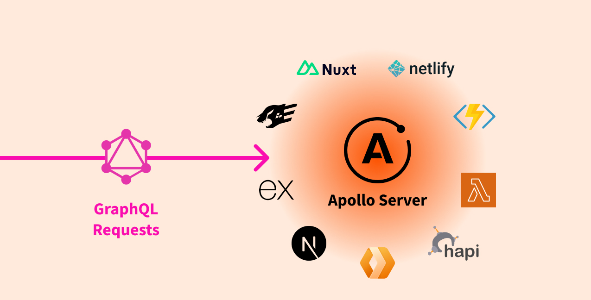

**Apollo Server 是一个[开源](https://github.com/apollographql/apollo-server)、规范化的 GraphQL 服务器实现。** 它兼容任何 GraphQL client，包括 [Apollo Client](https://www.apollographql.com/docs/react)。这是构建产品化、自文档式、数据存储方式无关的 GraphQL API 的最佳方式。

#### 你可以将 Apollo Server 用于：

- 将 GraphQL server 作为超级 GraphQL 服务中的[子服务](https://www.apollographql.com/docs/apollo-server/using-federation/apollo-subgraph-setup)
- 作为组件注入到现有的 Node.js 应用中。这些应用可以是基于 [Express](https://www.apollographql.com/docs/apollo-server/api/express-middleware)（包括[MERN](https://www.apollographql.com/docs/apollo-server/integrations/mern)技术栈）、[AWS Lambda](https://www.npmjs.com/package/@as-integrations/aws-lambda)、[Azure Functions](https://www.npmjs.com/package/@as-integrations/azure-functions)、[Cloudflare](https://www.npmjs.com/package/@as-integrations/cloudflare-workers)、[Fastify](https://www.npmjs.com/package/@as-integrations/fastify)，和[其他的框架或平台](https://www.apollographql.com/docs/apollo-server/integrations/integration-index)。

#### Apollo Server 可以提供什么能力：

- **简单的设置**，你的客户端开发人员可以快速的进行开发工作
- **渐进式引用**，是你能够按照实际需求来添加功能特性
- **优秀的兼容性**，与数据源、打包方式和客户端实现方式无关
- **生产能力完备**，是你可以更自信的将 GraphQL 应用部署到生产环境
